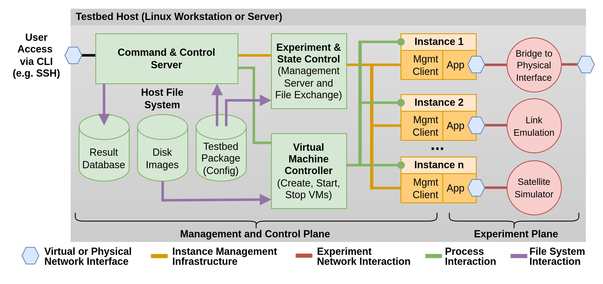
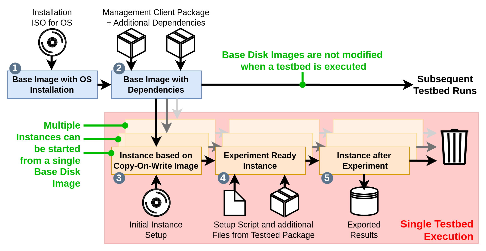

# Proto²Testbed

*Testbed framework for security **proto**col evaluation and **proto**typing.*

Proto²Testbed is a tool for research and development in the field of network applications and protocols. 
A virtual topology is created using several virtual machines (called instances), which are connected to each other using network bridges.
The structure of the topology, the configuration and also experiments are defined via a testbed package.
After a small amount of manual configuration, Proto²Testbed takes care of setting up and dismantling the topology and carrying out experiments, if desired, completely automated way.
Proto²Testbed can be used for various workflows and can be extended with functions for specific projects thanks to its modular approach.

Proto²Testbed was first introduced at the 12th Advanced Satellite Multimedia Systems Conference (ASMS) 2025, BibTeX citation:
```
@inproceedings{proto2testbed,
    author={Ottens, Martin and Deutschmann, Jörg and Hielscher, Kai-Steffen and German, Reinhard},
    booktitle={2025 12th Advanced Satellite Multimedia Systems Conference and the 18th Signal Processing for Space Communications Workshop (ASMS/SPSC)}, 
    title={Proto2Testbed: Towards an Integrated Testbed for Evaluating End-to-End Security Protocols in Satellite Constellations}, 
    year={2025},
    pages={1-8},
    doi={10.1109/ASMS/SPSC64465.2025.10946051}
}
```

## 1. Functional Overview & Terms
- The main part of Proto²Testbed, the **Controller**, is installed on a *Debian 12* workstation, server or even desktop. This system is called the **Testbed Host**.
- The Topology of a testbed and some configurations are defined in the testbed configuration file `testbed.json`, this file is bundled together with scripts and additional dependencies that are used during a testbed execution to form a **Testbed Package**.
- The Controller reads the configuration file. It starts and configures virtual machines, called **Instances**. Instances are run using *QEMU* and connected using Linux Layer-2-Network-Bridges.
- Instances are based on Disk Images, these images are used in a read only way - all changes to the file system of an Instance are temporary. Proto²Testbed provides tools to automatically create the required disk images. Since all Instances are fully virtualized, tests with kernel modules are possible, which is often not the case with other testbed frameworks.
- The **Instance Manager** is installed on each Instance and handles communication with the Controller, performs the configuration of the Instance and can carry out experiments.
- Experiments are done using **Applications**. These are programs written in *Python* and executed on the Instances with settings defined in the testbed configuration. Proto²Testbed comes with some bundled Applications, but an easy API allows for development of own Applications.
- A testbed run can yield different types of experiment artifacts: Applications usually write datapoints to an *InfluxDB* - the framework includes functions to export the data. It is also possible to save files from Instances on the Testbed Host before the testbed is dismantled.
- Proto²Testbed also allows real network interfaces of the Testbed Host to be integrated into a virtual testbed topology. **Integrations** are available to execute special functions on the Testbed Host during testbed runs.
- With the right preparation, each testbed run has only a few seconds overhead for the creation and setup of the instances - a virtual topology is available in just a few seconds.
- In addition to the fully automatic operation, numerous CLI features also allow a testbed to be used interactively - great for debugging or prototyping.
- Variables in the testbed configuration allows the test of different environments or scenarios. Especially with integration in CI/CD tools, Proto²Testbed can also be used as a tool for automatic software tests.

> **Some important notes:**
> - Proto²Testbed uses KVM, so KVM needs to be available on your machine. The framework provides an option to disable KVM (e.g. for test installations on a virtual machine) but this will severely limit the performance. Nested KVM could also be used during tests on VMs.
> - Proto²Testbed needs access to the KVM subsystem of the Testbed Host as well as the ability to manage the Testbed Hosts network interfaces. Therefore, privileges are required. Execute testbeds with root privileges (e.g. using `sudo`). Users who have access to the framework should always be trusted.

A testbed environment provided by Proto²Testbed with some of its internal functions can be found in the following image:


## 2. What can Proto²Testbed be used for?
There are two main use cases:

### Automated Experiments
Proto²Testbed can run experiments (e.g., end-to-end protocol tests, bandwidth tests) in a fully automated way. 
This can be used for automated software tests or to evaluate protocols and applications in a large variety of environments or scenarios. 
Since Proto²Testbed uses virtual machines as hosts, there are no limitations of what kind of network software can be evaluated (e.g., modifications to the Linux kernel - which is not possible with dockerized setups).

Results of experiments from a testbed run can be the following:
- Time series of numeric values, stored in an InfluxDB or exported to images or CSV files (e.g., RTT or bandwidth statistics)
- Arbitrary files that are copied from an Instance to the Testbed Host after the completion of a testbed run for subsequent manual analysis (e.g., packet dumps or log files)

Experiments can be executed in the following way:
- By using Applications. These are Python programs wrapping software (e.g., ping or iperf3). These are Python programs that wrap software and are executed on the instances. Data points or files can be added as results using an API.
- Using bash scripts, which may be faster to write than applications. They can add experiments results using the `im` tool, which is available on the instances.

### Prototyping and Manual Experiments
Testbed executions can be paused at various points of a testbed run. 
At this point, manual interactions with the Instances are possible (via a serial console or SSH, when enabled) is possible - use Proto²Testbed just as a builder for disposable topologies and interact with the Instances as they are normal machines. 
Even without SSH access it is possible to copy files from the Instance to the Testbed Host and the other way around. Using the `im` tool on the Instances, it is possible to manually add results.

After manual interaction (e.g., for debugging or setup) it is possible to continue the testbed execution, for example to run automated experiments.

## 3. Requirements and Installation
Proto²Testbed currently has the following requirements:
- **OS**: Debian 12 "Bookworm", other Debian-based OSes are possible as long as the dependencies are satisfied. Since Proto²Testbed currently has no GUI, a headless installation is sufficient. Users can interact with the framework by using SSH.
- **CPU**: Use any x86 CPU. Do not under provision. An Instance should use 2 Threads, so the maximum Number of Instances started in parallel should not exceed *#Threads / 2*. Remember, that parallel testbed executions are possible.
- **Memory**: Plan around 1GB per Instance, depends on tested protocols and applications.

### Using Docker
Proto²Testbed can be used with Docker images. See [`docs/docker.md`](docs/docker.md) for details.
Images are available in the [Docker Hub](https://hub.docker.com/r/martinottens/proto2testbed).

### Automated Installation
Clone this repository to `/opt/proto-testbed` and run `sudo install.sh` to install Proto²Testbed system-wide with all dependencies. No additional manual steps are required.

### Manual Installation
For a manual installation, the following apt-dependencies are required:
```
qemu-utils qemu-system-x86 qemu-system-gui bridge-utils iptables net-tools genisoimage python3 iproute2 influxdb influxdb-client make socat

# Python packages from apt (system-wide installation):
python3-jinja2 python3-pexpect python3-loguru python3-jsonschema python3-influxdb python3-psutil

# Optional for plot generation:
python3-numpy python3-matplotlib
```

Python dependencies could also be installed in a virtual environment:
```bash
apt install python3-virtualenv python3-pip
virtualenv -p python3 venv
source venv/bin/activate
pip install -r requirements.txt
```
All Proto²Testbed commands need to be executed in this virtual environment.

The file `/etc/proto2testbed/proto2testbed_defaults.json` (see `/proto2testbed_defaults.json`) should exist on the system. The database referenced in this config can be added with the following command:
```bash
influx -execute 'CREATE DATABASE testbed'
```

For ease of use, create the following symlinks:
```bash
ln -s /opt/proto-testbed/proto-testbed /usr/local/bin/p2t
ln -s /opt/proto-testbed/baseimage-creation/im-installer.py /usr/local/bin/p2t-genimg
```

## 4. Quick Start Checklist
1. Install Proto²Testbed
2. Generate a base disk image with basic OS installation, see [`baseimage-creation/README.md`](baseimage-creation/README.md)
3. Install the Instance Manager and possibly additional dependencies to a testbed base image, see [`baseimage-creation/README.md`](baseimage-creation/README.md)
4. Create a testbed package with a testbed, see [`docs/testbed-package.md`](docs/testbed-package.md)
5. Execute the testbed and let the framework perform all experiments, see [`docs/commands.md`](docs/commands.md)
6. Export the results to plots or CSV files, see [`docs/commands.md`](docs/commands.md)
7. Clean up results, see [`docs/commands.md`](docs/commands.md)

### Typical Workflow for automated Experiments
Even though Proto²Testbed can be used in very different ways, we envision the application for automated experiments as follows. 
The creation of different disk images is particularly relevant here in order to reduce the overhead for starting a testbed to a few seconds.


1. Create a base image with a basic OS installation
2. Install the Instance Manager and additional dependencies to create a base disk images for experiments. Additional dependencies can be software, configurations and so on that does not change for different testbed runs or are identical for all Instances in a testbed. By performing the installation at an early stage, the startup time of a Testbed can be reduced. A base disk image can be used by multiple Instances and is not modified during testbed runs. A disk images used in a testbed run needs the Installation of the Instance Manager.
3. During the startup of a testbed, Instances are created from the base images as defined in the `testbed.json`. Some initial preparation is done by *cloud-init* at startup.
4. After the startup, a setup script can be executed on the Instance that is provided in the Testbed Package. Additional and testbed run/Instance specific dependencies (e.g., kernel modules or software that is to be evaluated in the testbed) can be installed by the setup script (loaded from within the testbed package or downloaded from the internet (when management network is enabled)). The setup scripts also needs to perform the network configuration of the Instances.
5. When the setup is completed, the Instances are ready for the experiment and Applications are executed, pushing results (time series data) to the Controller or marking files for preservation when the testbed is stopped. After the Experiment is completed, the testbed is shut down - all Instances and the virtual topology is fully destroyed.

## 5. Interacting with Proto²Testbed
Proto²Testbeds `p2t` command (or `./proto-testbed` if not installed globally) is the main way to interact with the framework. The following subcommands are currently available:

- `sudo p2t run`: Execute a testbed
- `p2t attach`: Attach to an Instance in a testbed
- `p2t list`: List all testbeds with Instances and networks 
- `p2t export`: Export results from an experiment to plots or CSV files
- `p2t clean`: Clean up experiment results
- `sudo p2t prune`: Delete dangling testbeds

Testbeds and result data produced by them can be identified with an experiment tag,
this tag should unique across multiple testbed runs. If a testbed is executed without an experiment tag, a random one will be generated.

See [`docs/commands.md`](docs/commands.md) for further details on how to use Proto²Testbed.

## 6. Prepare a Base Image and execute an Example
Before a testbed can be executed, a base image with a minimal OS installation has to be created. To create a *Debian 12* base image, see [`baseimage-creation/README.md`](baseimage-creation/README.md).

See `setups/` for some (advanced) usage examples. These examples are an excellent starting point for familiarizing yourself with Proto²Testbed. 
The `README` files provide an overview of the setups and give instructions on how to run the examples.

## 7. Testbed Configuration
For a testbed run, a **Testbed Package** is required. A testbed package must contain at least the testbed configuration `testbed.json`, see [`docs/testbed-package.md`](docs/testbed-package.md) for further details.

The Testbed Package is made available in the file system of all Instances during testbed runs in read-only way. It therefore can contain other things:
- A setup script, that is called during testbed startup to make the Instance ready for an experiment (e.g., setting up network interfaces, performing configurations)
- Configuration files, binaries or additional scripts used by the setup scripts
- Scripts that are executes during automated experiments (and there dependencies)
- Experiment-specific Python source files of Applications or Integrations (not packaged in the Instance Manager or Testbed Controller and dynamically loaded during testbed execution from within the Testbed Package), see [`docs/extensions.md`](docs/extensions.md) for further details

## 8. Hacking & Extension
Proto²Testbed can be easily extended for special requirements, see [`docs/extensions.md`](docs/extensions.md) for further details:
- With the development of own **Applications** (packaged in the Instance Manager (see `applications/`) or dynamically loaded (see `extra-applications/`))
- With the development of own **Integrations** (packages in the Testbed Controller (see `controller/integrations/`) or dynamically loaded)
- Own top-level commands for the Testbed Controller (see `controller/executors/`)

Proto²Testbed can also be used in automated workflows, e.g., for automated, fully integrated end-to-end software tests in GitLab CI/CD. See [`docs/gitlab-integration.md`](docs/gitlab-integration.md) for further details.

## 9. License
This project is licensed under the [GNU General Public License v3.0](LICENSE). For more details, see the `LICENSE` file or see https://www.gnu.org/licenses/.
